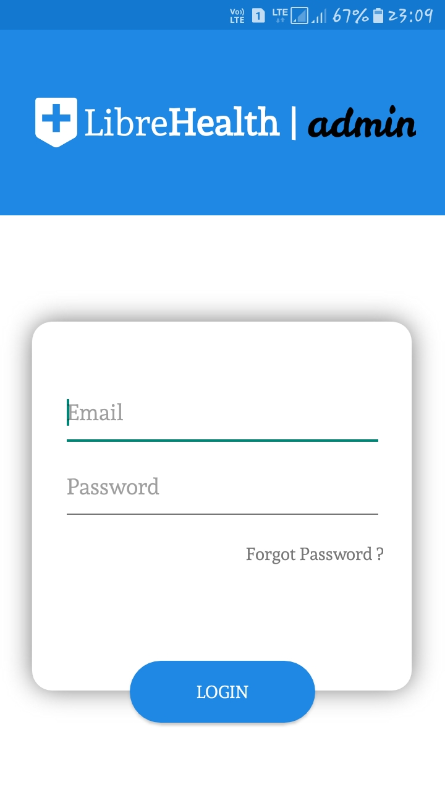
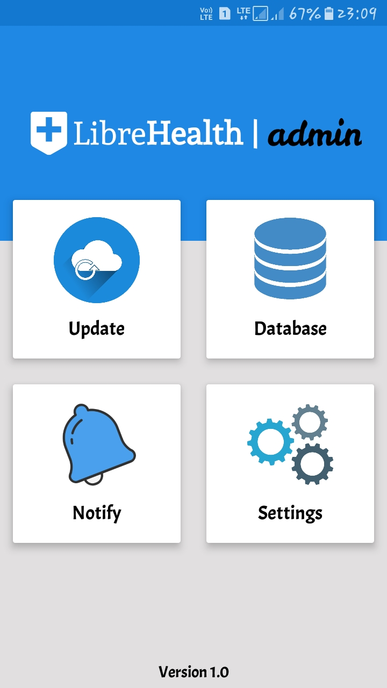
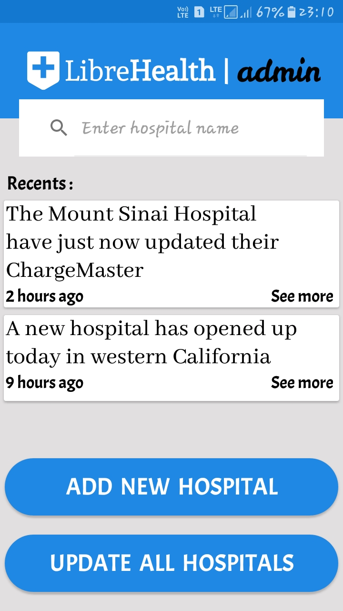
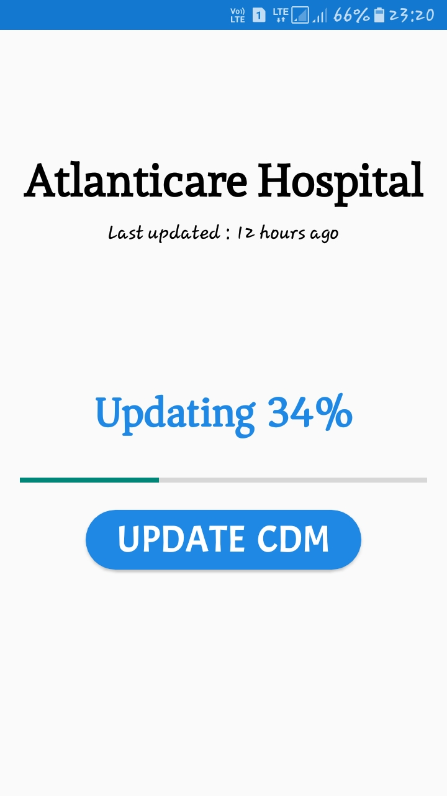
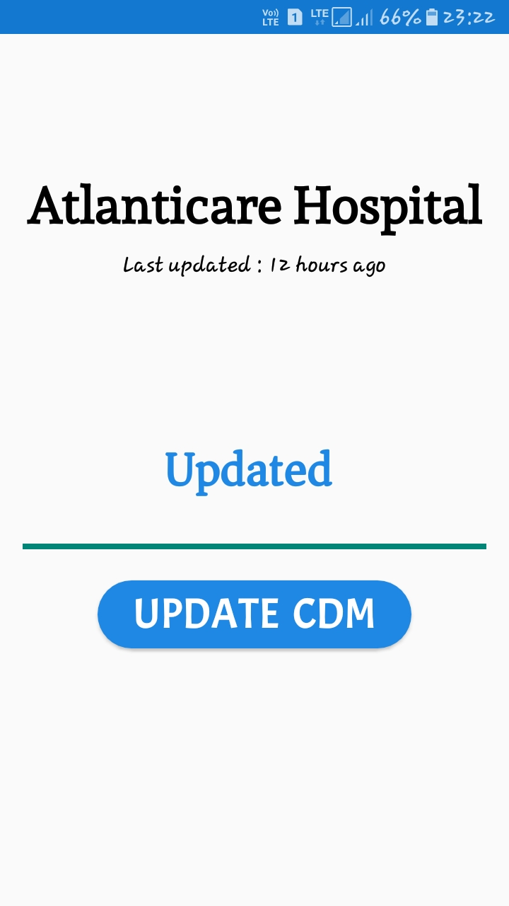
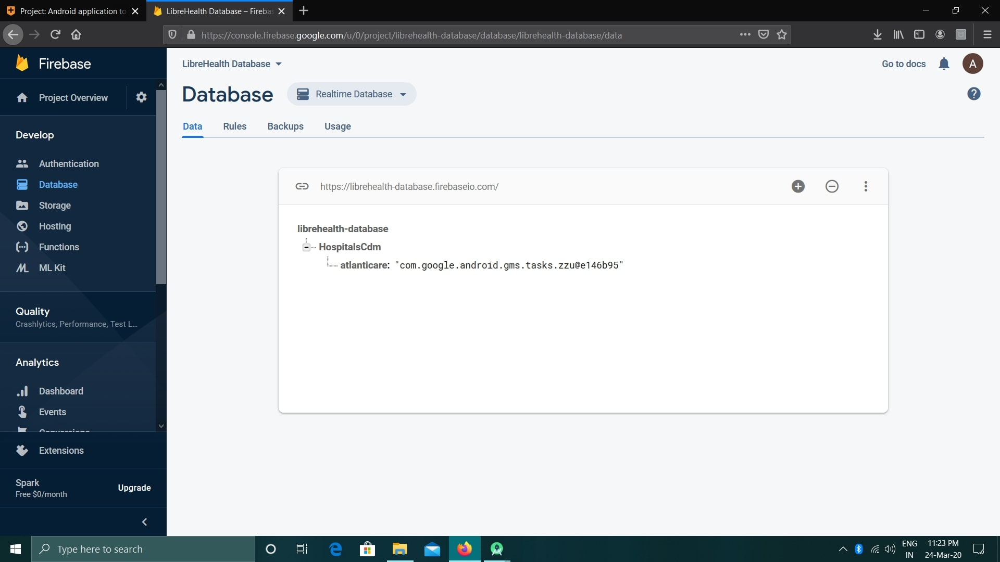
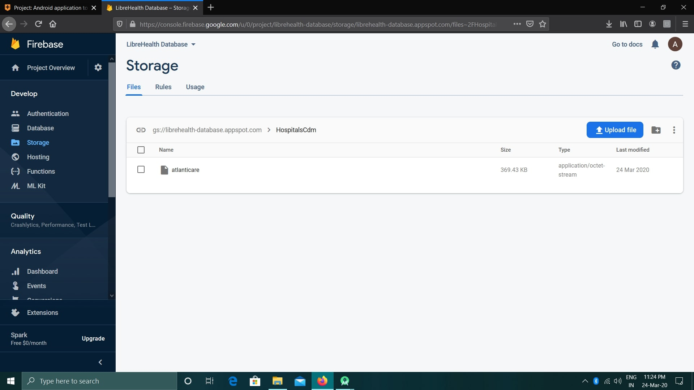

# librehealth-admin
## About
It is the backend application of my LibreHealth POC application. I have implemented web scraping using Retrofit Android.
Retrofit is type-safe REST client for Android and Java which aims to make it easier to consume RESTful web services.

As this is a prototype application so here I am pinging only one hospital(Atlenticare Hospital).
The application downloads Atlenticare Hospital's CDM and uploads it to FireBase Storage and the url of FireBase Storage to FireBase Realtime Database(for easy accessing).

## Prerequisite
For now to login into the application you can enter any dummy data or simply click the login button to log in.

## ScreenShots

### Application ScreenShots
    

  

### FireBase ScreenShots
   

